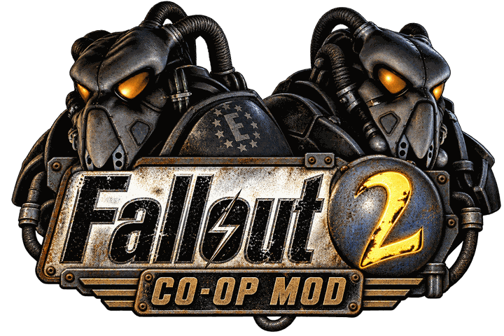
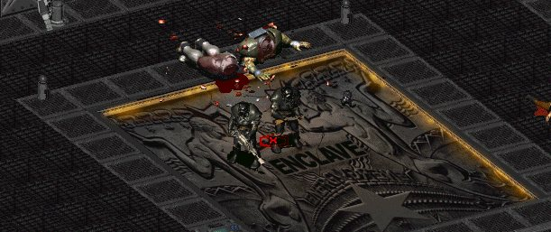
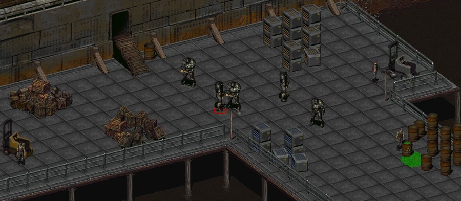
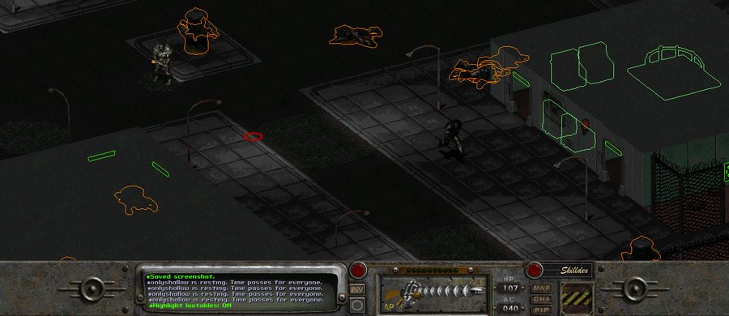
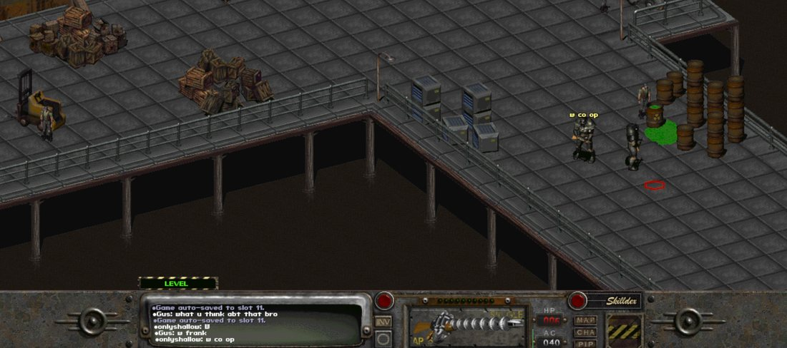

<div align="center">



# Fallout 2 Co-op

**Play Fallout 2 together. One dedicated server owns the world; every player joins it with their own character.**

[](https://github.com/gusmarcum/fallout2-coop/actions/workflows/ci-build.yml)
[](https://github.com/gusmarcum/fallout2-coop/releases/latest)
[](https://github.com/gusmarcum/fallout2-coop/releases)

[](LICENSE.md)


[Download](#download) · [What this project adds](#what-this-project-adds) · [Quick start](#quick-start) · [Keys](#keys-in-the-client) · [Server settings](#server-settings) · [Admin console](#admin-console) · [Building](#building-on-windows) · [Changelog](CHANGELOG.md)



<sub>Two players, one world, Frank Horrigan down. The whole game, co-op.</sub>

</div>

One PC runs a dedicated server that owns the world: scripts, combat, dialogue, the worldmap,
saves. Every player runs a client that shows that shared world and sends what they do.
Several people, one persistent game, each with their own character, and the world keeps
going while someone is away.

Built on [Fallout 2 Community Edition](https://github.com/alexbatalov/fallout2-ce), derived
from [Cahb/fallout2-ce-coop](https://github.com/Cahb/fallout2-ce-coop) v0.4, and developed
here as its own project. No game files are included: bring your own Fallout 2 (Steam or GOG,
US 1.02d). Licence: Sustainable Use (non-commercial), inherited from Fallout 2 Community
Edition.

<table align="center">
  <tr>
    <td align="center"><br><sub>Five players in one world, San Francisco</sub></td>
    <td align="center"><br><sub>Navarro, cleared</sub></td>
  </tr>
</table>

<div align="center">

| | |
|---|---|
| **Players** | 2 or more, one character each, all in the same persistent world |
| **You need** | Your own Fallout 2 (Steam or GOG, US 1.02d) and Windows 10 or 11, 64-bit |
| **Host runs** | `f2_server.exe`, a dedicated server that owns the world |
| **Everyone runs** | `fallout2-ce.exe`, the client that joins it |
| **Over the internet** | Through a VPN such as ZeroTier; nothing is exposed to the open internet |

</div>

## Download

**[Latest release](https://github.com/gusmarcum/fallout2-coop/releases/latest)**: a zip with
`f2_server.exe`, `fallout2-ce.exe`, this README, the licence and a quick-start note. The two
exes are also attached loose for people who only need the client.

- Windows 10 or 11, 64-bit. Both exes are statically linked; there is nothing else to install.
- You need your own Fallout 2 (Steam or GOG, US 1.02d). The server and every client must have
  identical game data, and they must all run the same release of this project.
- Windows may warn about an unsigned executable the first time: More info, Run anyway.
- Play over a VPN such as ZeroTier. Never forward the game port or the admin port to the
  internet; neither has authentication.

## What this project adds

Everything below came out of real two-player sessions, fixing mistakes left in the original
project's AI-written code. Each issue was traced by hand to its cause in the engine, fixed at
the cause, and verified against a 41-scenario regression suite before it shipped. The commit
history carries the full reasoning for each one, and the [`bugs/`](bugs) folder records the
live-play reports with symptom, cause and fix.

### Playing together

**The whole game, start to finish.** Fallout 2 has been played from the Temple of Trials
through Frank Horrigan in co-op, ending slides and all, and the world is still there
afterwards if you want to keep going. That is what the version number means. The ending
is server-driven now rather than each client running it off its own local script
execution: the server announces it, every player sees the same sequence, and the slides
are chosen from the globals that world actually earned.

**Trading between players.** Talking to another player used to answer "That's another
player." It now proposes a trade: the other player gets a yes/no box, and on yes both
open the vanilla trade screen with each other, the world still running for everyone else.
Each side drags goods onto its own table and presses Offer to lock them; when both sides
are locked the server asks each player, in the same box the random encounters use, whether
they accept exactly what is on the two tables. Two yeses swap the tables, one no ends the
trade with everything back where it came from, and nothing can change once the question is
out, so what you read in the box is what you get. Stealing from another player is refused
at the server; the skill still works on everyone else.

**Death is a team matter.** A dead player no longer stands back up on their own: a living
teammate revives them, free out of combat and for 4 action points on their own turn in a
fight, by using their body, a healing item on it, or First Aid or Doctor. A player revived
mid-fight gets their turns back. When nobody is left standing, every client plays the
vanilla death screen and the server reloads the most recently written save, whichever slot
that is, without anyone leaving the server. A world with no save yet stands the party back
up where it fell instead.

**Quicksave and quickload.** Vanilla's `F6` and `F7`, server-side. `F6` writes the server's
slot 16; `F7` reloads it in place for every connected player, through the same rebuild each
client already performs after a map change, and the game says who pressed it. It works in
combat, where it ends the fight the way single-player's does, and while dead, so a failed
steal or a lost fight can be retried. The operator's `load <n>` takes the same path while a
world runs, so restoring a slot no longer needs a server restart.

**Companion combat orders in co-op.** Vanilla's Combat Control window runs a local loop on
the machine that opens it and edits a local copy of the companion's settings, which the
server never sees, so the feature was unreachable in co-op. The Combat Control button on a
companion now opens their orders as a dialogue node served by the server: burst, run away,
weapon preference, distance, target, chem use. Pick a line to cycle it, Done to return. A
Disposition line at the top cycles the five vanilla presets (Custom, Coward, Defensive,
Aggressive, Berserk), and editing a single order switches to Custom first, as vanilla does.
Same settings, same labels, saved with the game.

**Companions know who they belong to.** The follow logic read the single-player "the
player" variable, which on a server with several players resolved to whoever the last action
left behind, usually the host. Companions beelined for the wrong person or flip-flopped
between two. Each party member now records who recruited them and follows that player,
falling back to the nearest one on the same floor. A companion standing in a doorway used to
fail every walk through it with "You cannot get there"; when party members are the only
thing in the way they now step aside and the walk is retried.

**Companions survive a map change after a load.** The map save writes party members with
their keep-on-map flags cleared and nothing re-armed them after a load, so the first map
change after restoring a world deleted every companion's body and the next load dropped them
from the party. The flags are re-armed on load, and the console gained `party` (list) and
`partyadd <pid>` (re-attach a companion standing on the current map) for worlds already hit.

### Fixed from live play

**The world survives a reconnect.** Co-op players reconnect a lot. Before, a rejoining
client came back to a map where every visited town had turned unknown again, the Pip-Boy
showed finished quests as open, and dead players stood back up. All three had the same
shape: the server knew the truth, but a joining client was only ever sent the changes that
happened after it arrived. Joins now carry the whole city table, the whole quest-variable
table, and no longer rebuild a dead player's standing pose.

**Computers and terminals work.** Every talking piece of scenery in the game, the Gecko
power plant's robot terminal among them, starts its conversation through an engine request
that only the vanilla client loop ever serviced. The dedicated server never ran that loop, so
each of those terminals silently did nothing in co-op. The server tick now services the
request, and the conversation is attributed to the player who clicked, so their answers are
accepted.

**Sound that tells you what is wrong.** The client's audio initialisation compared the SDL
result with the wrong failure value, so a refused audio device passed as open and a player
simply had no sound, with no error anywhere. The client now detects it, tries the other
audio drivers, and prints the reason on the message line if it still cannot play. Music that
died (a stall while another player joined, a movie that never resumed it) is restarted by a
watchdog instead of staying dead for the session. The watchdog also remembers a track the
client started on its own map load, so music that dies during a map change comes back
without a rejoin, and a change between two maps that share a track (Vault City's courtyard
and downtown, San Francisco's docks and Chinatown) no longer leaves the track silent for the
whole visit.

**Dialogue that works over the wire.** Stale reply options no longer draw over the new node.
Long replies page (Down, Page Down or SPACE forward, Up or Page Up back). The Review button
shows the conversation's history, which the client now records itself. Chat opens on `T`,
also in combat, where Enter is the end-combat key.

**Doors and elevators stay where they belong.** Vault-style sliding doors and elevator doors
move by per-frame art offsets that the animation accumulates into the object's position. The
headless server never animates, and the code that stepped its door frames subtracted the
wrong frames' offsets, nine pixels short per open-and-close cycle, so doors crept upward and
the drift went into every map save and every join: a Navarro door ended up 88 pixels above
its doorway. Frames now step exactly as the animation would, and every door is put back on
its frame's offsets at each map load, so existing worlds heal themselves. Elevators ask for
the floor once instead of twice, and a scripted door such as the San Francisco Brotherhood
entrance no longer opens and closes in the same beat.

**The second player gets the same game as the host.** Several things worked for the host
character and silently not for anyone else. Armor perks (the T-51b's +3 Strength and its
radiation resistance) sat behind a party-member check that only the host passed; they now
apply to every player. A player being stolen from watched their worn armor and weapons
vanish from their own screen while the server parked them; the screen keeps them. The
action-point bar could open a turn showing last turn's leftover while the server held the
full budget. An offline teammate's parked body could appear glued to the top-left corner of
the screen, above the roof. And a player's sprite now follows the hand selected on the
interface bar, as in vanilla, instead of whichever hand happened to hold a weapon.

**Guards stopped shooting the second player for a holstered gun.** Putting your weapon
away in NCR, New Reno or at the Vault City gate does not mean dropping it: you switch to
your empty hand, and a script reads the hand you are holding up. Two things broke that on
a dedicated server. The opcode asked an interface stub pinned to one hand, so swapping was
invisible to every script in the game, and the filter was applied only to the anchored
player, so everyone else reported both hands unconditionally. The second player could
comply perfectly and still get shot. Every script-facing hand reader now resolves the real
active hand, for every player.

**Small things that mattered in play.** Two-handed weapons stopped occupying both hand slots.
Arming one explosive from a stack arms one, not the stack. TAB opens the automap. Push works
on companions. A stuck wait cursor clears itself. The operator's `save` refuses at moments
when it would have failed silently, `gvar` reads or repairs a world's quest flags, and
`spawn` attaches the NPC's script so a spawned companion talks. A world whose Vault City gate
answers "You cannot get there" while standing open can be repaired with
[`tools/repair_vault_city_gate.py`](tools/repair_vault_city_gate.py)
([bug note 008](bugs/008-vault-city-gate-blocker.md)).

### Under the hood

**The server never waits on a slow client.** Every frame went out through a blocking send
with a five-second timeout, so a client that stopped reading its socket, which every client
does for a few seconds while it loads a new map, froze the whole world for everyone: movement
landed seconds late, queued clicks arrived in a burst, menus lagged and the music mixer
starved. Sends are now non-blocking with a per-client queue, and a client that takes nothing
for a minute is dropped instead of stalling the rest. Measured with a client that stops
reading: a 20 second freeze before, 0.2 seconds after. The server window reports a client
that has stopped draining its stream, with how much is queued for it.

**Crashes traced to their pointer.** Two heap-corruption crashes on the client had one root:
the engine merges identical inventory stacks and frees the merged object, while the network
mirror still remembered it and freed it again. Wire stacks are now mirrored as their own
slots, the engine tells the mirror about every object it frees, and a registry of live
objects turns any remaining stale pointer into a logged skip instead of a crash, with the
object named in `debug.log`. An out-of-combat input block is capped at three seconds and
names the stuck animation.

**A test harness that runs on Windows.** The engine's two golden suites, 41 headless
scenarios that replay fixed inputs and compare the resulting world state byte for byte, only
ran on Linux. Headless probes now run on Windows: exempt from the single-instance locks,
deterministic (the RNG seed no longer comes from the wall clock), and blessed against a
Windows result set. Every commit in this repository passes both suites, and CI builds the two
shipped binaries with the same MSYS2 toolchain and flags on every push. Each feature also
ships with a headless proof script under [`tools/`](tools) that drives a sandbox server with
fake clients: trade and death, quicksave, armor perks, the parked body, inventory.

## Quick start

**Host** (runs the server, and usually a client too)

1. Copy your Fallout 2 folder somewhere new, for example `D:\Games\Fallout2Coop`. That copy
   is the world; its `data\SAVEGAME` holds the co-op saves.
2. Put `f2_server.exe` and `fallout2-ce.exe` from a release into that folder.
3. Start the server from a `.cmd` file in that folder:

```bat
@echo off
cd /d "%~dp0"
set F2_SERVER_MAP=artemple.map
set F2_SERVER_NET=9300
set F2_SERVER_CMD=9301
set F2_SERVER_PACE_MS=100
set F2_AUTOSAVE_SECS=300
set F2_MOVIES=0
set F2_SERVER_NAME=Our game
f2_server.exe
pause
```

   To continue a saved world use `set F2_SERVER_LOAD=<slot>` instead of `F2_SERVER_MAP`.
   Slots 1 to 10 are manual saves, 11 to 15 the rotating autosaves, 16 the quicksave.
4. Join from the same PC:

```bat
@echo off
cd /d "%~dp0"
set F2_CLIENT_CONNECT=127.0.0.1:9300
set F2_PLAYER_NAME=Gus
set F2_PLAYER_CREATE=ask
fallout2-ce.exe
```

**Other players**

Put `fallout2-ce.exe` next to your own Fallout 2 files and start it from a `.cmd` with the
host's address:

```bat
@echo off
cd /d "%~dp0"
set F2_CLIENT_CONNECT=10.144.94.83:9300
set F2_PLAYER_NAME=Friend
set F2_PLAYER_CREATE=ask
fallout2-ce.exe
```

The first time a name is seen you create a character; after that the same name is the same
character, with the inventory, level and quest state you had when you last played. Names
must differ between players and stay the same across sessions. While you are away your body
is parked; when you come back it is placed next to the host, on whatever map the host is on.

A VPN such as ZeroTier is the recommended way to play over the internet. Do not forward the
game port to the internet: the wire has no authentication. The client reads `fallout2.cfg`
from the folder the exe is in, so keep it next to the game files.

## Keys in the client

<p align="center">
  <br>
  <sub><code>T</code> opens chat, in combat too</sub>
</p>


| Key | What it does |
|---|---|
| `T` | open chat, also during combat (Enter still ends combat in a fight) |
| `TAB` | automap (out of combat) |
| `P` | Pip-Boy (holodisks, quests, automaps; refused in combat like vanilla) |
| left click / hold on another player, Talk | propose a trade; they answer a yes/no box |
| in the trade screen: `M` / Offer | lock your offer (press again to unlock); when both sides are locked the accept boxes appear |
| in the trade screen: `T` / Talk, `Esc` | leave the trade, everything goes back |
| left click / hold on a dead player, Use | revive them at 1 HP (free out of combat, 4 AP on your turn in a fight) |
| `R` | when dead: reminds you that a teammate has to revive you |
| `F6` / `F7` | quicksave / quickload (server slot 16). `F7` rewinds the game for everyone; works in combat and while dead; main screen only, as in vanilla |
| `Down` / `PgDn` / `SPACE` | next page of a long dialogue reply; `Up` / `PgUp` previous page |
| Review button | this conversation's history |
| Combat Control button | on a companion: their combat orders |
| hold left click on a companion | menu with Push |
| `Esc` on the elevator panel | close it without riding |

## Server settings

Set these as environment variables before starting `f2_server.exe`.

| Variable | Default | Meaning |
|---|---|---|
| `F2_SERVER_MAP` | | boot a fresh world on this map |
| `F2_SERVER_LOAD` | | restore save slot 1-16 (11-15 = autosaves, 16 = quicksave) |
| `F2_SERVER_NET` | | game port for clients |
| `F2_SERVER_CMD` | | admin console port (see below); never expose it |
| `F2_SERVER_PACE_MS` | `0` | ms per beat; `100` is about real time |
| `F2_SERVER_HOST` | first to join | pin slot 0 (drives worldmap travel and map changes) to a player name |
| `F2_SERVER_NAME` | | name shown to clients |
| `F2_AUTOSAVE_SECS` | `300` | autosave interval into slots 11-15; `0` = off |
| `F2_SERVER_KEEPALIVE` | on if CMD set | keep running when the last player leaves |
| `F2_GAME_DIFFICULTY` / `F2_COMBAT_DIFFICULTY` | from cfg | `0` easy, `1` normal, `2` hard |
| `F2_MOVIES` | on | `0` skips scripted movies; use it if a joining client crashes on a cutscene |
| `F2_TRACE_WORLD` | off | `1` prints `[world]` lines for door, container and map-state changes |

The full list of variables and verbs, including the diagnostic ones, is in
[`DEDICATED_HOWTO.md`](DEDICATED_HOWTO.md).

## Admin console

Connect to the `F2_SERVER_CMD` port with a TCP tool (telnet, nc, or a small script) and send one
command per line. It answers once a client is connected; `help` lists everything.

| Command | Meaning |
|---|---|
| `status` | what is running |
| `saves` | list save slots |
| `save <1-16> [label]` | save the world (refused during combat, dialogue, travel, map change); 16 is the quicksave |
| `load <1-16>` | restore a slot; while a world runs it is reloaded in place for everyone (the `F7` path, by number) |
| `new <map.map>` | boot a fresh world (lobby only) |
| `revive <slot>` | stand a dead player up |
| `kill <slot>` | kill a player (for testing the revive and party-wipe rules) |
| `give <pid> <count>` | give items to the host character; `count` is stacks (boxes for ammo) |
| `gvar <index> [value]` | read or set a global script variable (quest flags) |
| `party` | list the party as the server sees it |
| `partyadd <pid>` | re-attach a companion standing on the current map (89 = John Cassidy) |
| `spawn <pid> [count] [tile] [script]` | spawn an NPC; `tile` -1 = beside the host; `script` is its scripts.lst number, needed for it to talk (Vic: `spawn 0x0100003E 1 -1 50`) |
| `despawnall` | remove every NPC spawned by this server run |
| `stat <slot> [stat] [value]` | read or set a seat's base SPECIAL (st pe en ch in ag lk); no stat = all seven, base and current |
| `ending` | play the ending slides and credits on every connected client |
| `say <channel> <text>` | a line to every client |
| `quit` | stop the server |

The admin port has no password. Keep it bound to localhost or a VPN interface only.

## Building on Windows

Install [MSYS2](https://www.msys2.org/), open the MINGW64 shell and run:

```bash
pacman -S --needed mingw-w64-x86_64-gcc mingw-w64-x86_64-cmake mingw-w64-x86_64-ninja git diffutils procps-ng
cmake -S . -B build-win -G Ninja -DCMAKE_BUILD_TYPE=Release -DCMAKE_POLICY_VERSION_MINIMUM=3.5 \
      -DCMAKE_C_FLAGS=-std=gnu17 -DCMAKE_EXE_LINKER_FLAGS="-static -static-libgcc -static-libstdc++"
cmake --build build-win --target f2_server fallout2-ce -j4
```

The two exes in `build-win` depend only on Windows system libraries. SDL2 and zlib are fetched
and built during configure. The same build runs in CI on every push
([`ci-build.yml`](.github/workflows/ci-build.yml)), with the Windows and Linux binaries
attached to each run as artifacts. Linux builds follow
[`DEDICATED_HOWTO.md`](DEDICATED_HOWTO.md).

## Testing

```bash
export F2_GAME_DIR=/path/to/a/game/folder F2_BIN=$F2_GAME_DIR/fallout2-ce.exe
F2_GOLDEN_DIR=$PWD/tests/golden/server-win tests/golden/run_golden_server.sh
F2_GOLDEN_DIR=$PWD/tests/golden/legacy-win  tests/golden/run_golden.sh
```

Copy the client exe into the game folder first: it reads its config from its own directory,
and the Windows goldens were blessed on Hard difficulty. The Windows result sets live in
`tests/golden/server-win` and `legacy-win`; the Linux sets are the checked-in default. Both
suites pass on every commit of this repository.

## Known limits

- No authentication on the game port; the admin port has none either. Use a VPN.
- One client per PC (the engine's single-instance lock); headless test probes are exempt.
- The world is one map at a time; players travel together.
- A companion's recruiter is not stored in saves; after a load they follow the nearest player
  until re-recruited.
- The Restoration Project and other sfall hook-script mods are not supported: hook scripts do
  not run in this engine. Server and every client must have identical game data.

## More documentation

- [`CHANGELOG.md`](CHANGELOG.md): what each release changed.
- [`AUTHORS.md`](AUTHORS.md): what in this repository is inherited and what was written here.
- [`DEDICATED_HOWTO.md`](DEDICATED_HOWTO.md): the operator reference, every environment
  variable and console verb, Linux and Docker.
- [`docs/ARCHITECTURE.md`](docs/ARCHITECTURE.md) and [`docs/MP_PROTOCOL.md`](docs/MP_PROTOCOL.md):
  how the server, the client and the wire fit together.
- [`bugs/`](bugs): the live-play bug notes, one file per report.
- [`tools/`](tools): sandbox proof scripts and repair tools.

## Contributors

- **[@adainstarks](https://github.com/adainstarks)** (William Starks) — testing. He played
  the co-op sessions this was built and fixed in, including the full playthrough behind the
  1.0.0 release. Nearly every note in [`bugs/`](bugs) began as a symptom he or I hit in a
  live game rather than something found by reading code.

## Credits

- [Fallout 2 Community Edition](https://github.com/alexbatalov/fallout2-ce) by Alexander Batalov
  and contributors: the engine.
- [Cahb/fallout2-ce-coop](https://github.com/Cahb/fallout2-ce-coop): the dedicated server, the
  network client and the wire protocol this project is derived from.
- Fallout 2 is the work of Black Isle Studios and Interplay.

A precise breakdown of what is inherited and what was written here is in
[`AUTHORS.md`](AUTHORS.md).

Licence: [Sustainable Use License](LICENSE.md).
